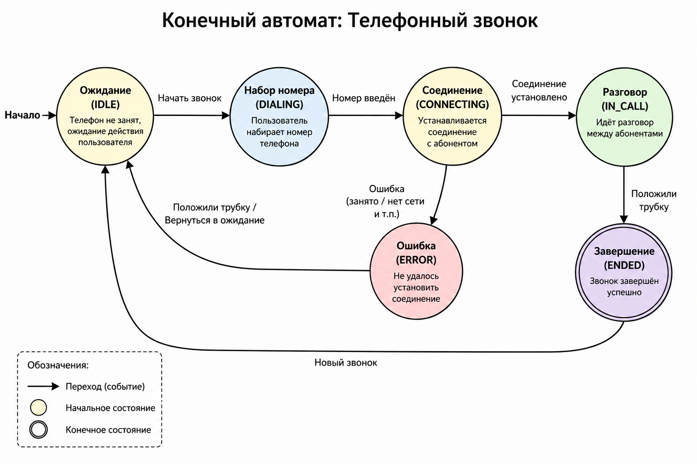

# Konechnie_avtomati

**Конечный автомат (FSM)** — это модель вычислений, которая в любой момент времени находится ровно в одном из конечного множества состояний. Переход между состояниями происходит по событиям/условиям.  

Я сделал простой конечный автомат для моделирования телефонного звонка (состояния: ожидание → набор номера → соединение → разговор → завершение + ошибки).

